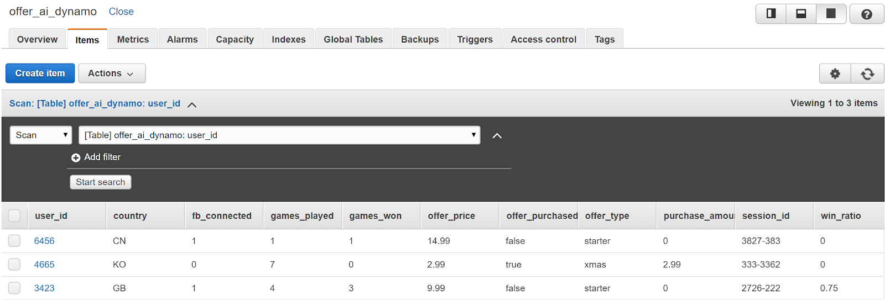
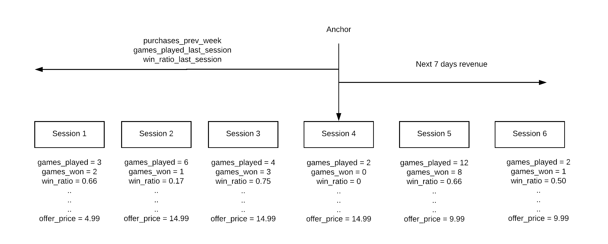

# Offer AI example

## What is Blurr?

Blurr is a data pipeline authoring environment for real-time predictive models. Work directly with raw data to construct a production ML pipeline in minutes. We believe in a world where everyone is a data engineer. Or a data scientist. Or an ML engineer. The distinction is increasingly blurry (*cough*). Just like development and operations merged over time into DevOps.

When working with data, it is important to iterate fast and the best way to do that is by working directly with the raw data. With Blurr we want to give product teams the ability to iterate quickly when doing ML dev and take things to production using a self-service model.

Blurr provides a high-level expressive YAML-based language called the Data Transform Configuration (DTC). The DTC defines custom data transformations and aggregations from a data source (S3), to transform the data (in lambdas) and output to a data store (DynamoDB). The data in the store can be used for any application dependent on real-time transformations like analytics or predictions.

Blurr has first class support for serverless data processing which means near zero standing costs, great for spiky usage, infinite scale and zero maintenance headache.

## Offer AI objective

Say we have a game. We want to be able to show personalized offers to the user via an in-app purchase.


To do that, we need the features that were used in training the model readily available to query when the users shows up. If we used `games_played_last_session` as one of the features, when the user starts a new session, we need the `games_played_last_session` data to query the model to get the prediction. Ideally, ASAP.

In this example, we'll work directly with raw data from events in the game to prepare the features needed to run such a model in production.  

This is a model that continuously learns based on the feedback received as the user interacts with the product and makes a purchase (or not). The model optimizes for a long term function - say, total revenue over 7 days.

To train the model, we need a dataset where we can observe how users behave when presented with different offers and prices. We want a contextual bandit approach to continuously personalize the ‘winning treatment’ for each user. More on contextual bandits  [here](http://pavel.surmenok.com/2017/08/26/contextual-bandits-and-reinforcement-learning/)

TODO: Broader article comparing A/B tests vs. contextual bandit

For the purposes of this example, let's say we want these features:

```
country
facebook_connected
purchases_prev_week_amount
games_played_last_session
win_ratio_last_session
```

The model predicts `next_7_days_revenue`. The `offer_type` and `offer_price` are picked from a list of offer candidates. The user is served the candidate for which the model predicts the highest `next_7_days_revenue`.

# Raw Data

Blurr assumes that there is raw data from the game landing
in an S3 bucket. Depending on your internal setup, this could be as simple as pointing your current raw data ingestion end-point (such as Firehose) to an S3 bucket.

We also assume that the raw data arrives in a JSON format.

Here’s an example JSON file with raw data from a game. Even though we are using a game example, we’ve built Blurr to be used in any product context - not just games.

## Peeking at raw data

We assume that when a user open the app and plays a game, the following events are sent as raw data.

```
[
{
'country': 'DE',
'language': 'DE',
'signin_method': 'https://www.instagram.com/DepictNone.2002',
'package_name': 'my_app',
'package_version': '1.0',
'os': 'Android',
'os_version': '6.4.5',
'device_type': 'phone',
'device_make': 'Acer',
'device_model': 'BlackBerry 10 Z30',
'device_id': '73f94c25-1d7a-f484-e194-0952b9a891f8',
'event_id': 'app_launched',
'event_time': '2017-08-14T17:53:57',
'customer_identifier': '72a039b9-6759-901a-cf3a-3354d21beed2',
'session_id': 'ey3je39-932u73'
},

{
'event_id': 'game_start',
'event_time': '2017-08-14T17:54:12',
'customer_identifier': '72a039b9-6759-901a-cf3a-3354d21beed2',
'session_id': 'ey3je39-932u73',
'currency_balance': '3400',
'level': '7'
},

{
'event_id': 'game_end',
'event_time': '2017-08-14T17:54:08',
'customer_identifier': '72a039b9-6759-901a-cf3a-3354d21beed2',
'session_id': 'ey3je39-932u73',
'currency_balance': '4000',
'level': '7',
'score': '8987',
'badge': '3',
'won': '1'
}
]

```

When an offer is shown, the following events are triggered. We assume that the offer is shown only once in a session.

```

[
{
'event_id': 'offer_shown',
'event_time': '2017-08-14T17:54:08',
'customer_identifier': '72a039b9-6759-901a-cf3a-3354d21beed2',
'session_id': 'ey3je39-932u73',
'currency_balance': '4000',
'offer_type': 'xmas'
'offer_price': '9.99'
'offer_purchased': 'false'
'offer_dismissed': 'true'
}

{
'event_id': 'purchase',
'event_time': '2017-08-14T17:54:08',
'customer_identifier': '72a039b9-6759-901a-cf3a-3354d21beed2',
'session_id': 'ey3je39-932u73',
'currency_balance': '4000',
'sku': 'coins-pack-4'
'txn_amount': '4.99'
'purchase_source': 'shop'
}
]

```

We want the end result to look like this - these are the features in the model.

user_id | country | facebook_connected | purchases_prev_week_amount | games_played_last_session | win_ratio_last_session
------- | ------- | ------------------ | -------------------------- | ------------------------- | ----------------------

# Writing data transforms

Data is prepared in a two step process.


First, we process raw data and aggregate into sessions. Processing instructions are defined in a Data Transform Configuration (DTC). Event Data + DTC creates DataGroups, which can be used as session aggregates.


Separate data transform configs (DTCs) are used for each step - Streaming DTC for stream processing (Step 1) and Window DTC for rollups (Step 2).

## Streaming DTC

[Streaming DTC](offer-ai-streaming-dtc.yml)

When the Streaming DTC is run, the data is added in DynamoDB.



Each ‘row’ is a session, because we defined the split in the DTC as `source.session_id != session_id`. If we had used `source.event_date != event_date`, the raw data would be aggregated by day. Any `boolean` expression can be used to define a split.

The second step is to perform window operations on the session aggregates. They are useful for making time window-based aggregations to prepare training and prediction query data for a machine learning model.

## Anchors and Windows

Windowing concepts in Blurr are similar to the concepts in [Apache Spark/Flink](https://softwaremill.com/windowing-in-big-data-streams-spark-flink-kafka-akka/).

The machine learning model is trying to predict a decision at a specific point in time. In our case, it is the offer to show the user. After the Streaming DTC has aggregated the raw data into 'blocks' - sessions in our case, a typical user's data is broken up like this.


When training a model, the data needs to be organized around the decision point.  We want to know the value of the features at the point an offer is shown. So if the offer is shown during session 4, the features need to be relative to session 4. And the optimization function (total revenue over next 7 days) needs to be relative to session 4 as well.



The decision point is the Anchor. A window defines segments of data relative to the anchor. In our case, we need the features and our optimization function relative to when an offer is shown.

Let's write the Window DTC that defines this.

## Window DTC

[Window DTC](offer-ai-window-dtc.yml)

The Window DTC is run periodically (we're thinking daily) to generate training data. How and where this is defined is TBD.

After a Window DTC is run, we have data in S3 for each anchor point.

user_id | purchases_prev_week_amount | games_played_last_session | win_ratio_last_session | next_7_days_revenue
------- | -------------------------- | ------------------------- | ---------------------- | -------------------
902844 | 1.99 | 6 | 0.50 | 0.99
768264 | 0 | 10 | 0.75 | 0
482640| 9.99 | 5 | 0.60 | 4.99

Combined with the sessionized data generated by the Streaming DTC, we now have our features ready.

# Training a model

Once the data is in S3 and DynamoDB, we can set up any training pipeline we want, as long as we can read the data from S3 and DynamoDB.

AWS Sagemaker is an option here to train the model and host it for predictions. We’ve also put together a guide to building your own AMI to run Tensorflow.

TODO: Write article and add link @vigbk

Sagemaker starts off with creating a hosted Jupyter notebook instance which is used for working with data and training models.

The [official Sagemaker documentation](https://docs.aws.amazon.com/sagemaker/latest/dg/how-it-works-training.html) has several great examples. We’ve included a notebook that describes how to build a model to [predict video game sales from reviews](AWS-Sagemaker-example-video-game-sales-xgboost.md). With Sagemaker, we can train with the data we’ve processed in S3 and deploy a model to be used as a prediction API.

# Use in production

Once this is in production, the end-to-end flow looks like this.


Tune, experiment and play around with data to improve the model. Remember to smell the roses on your journey to Higher Revenue Land!
